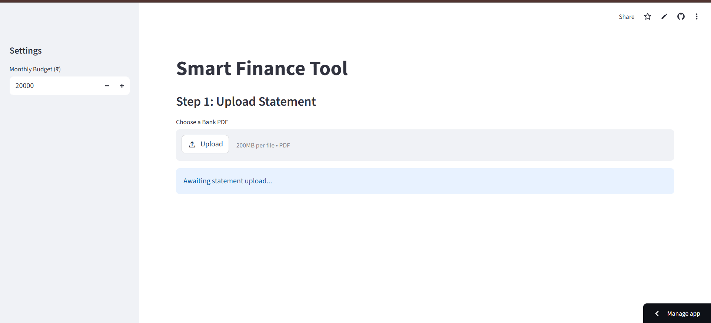
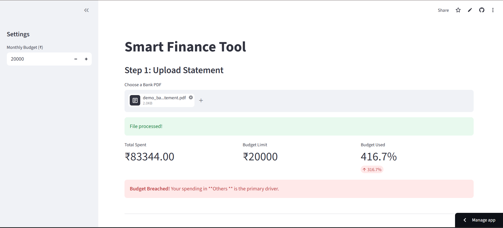
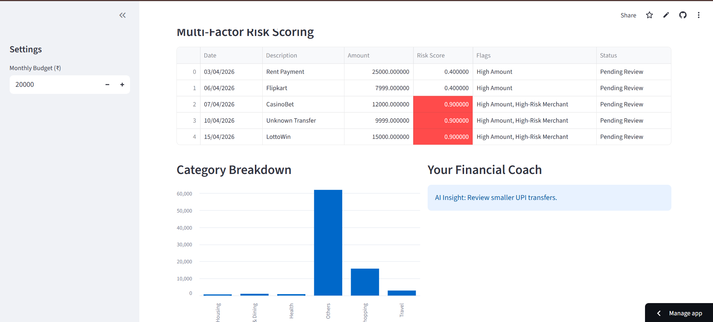

### Financial Risk Analyzer
A Streamlit-based FinTech tool that parses bank statements, redacts sensitive information, and uses a weighted risk engine to detect anomalous spending patterns.

### To check the app , download the attached pdfs and upload in the streamlit link here-
https://smart-finance-tool.streamlit.app/

TO DOWNLOAD DEMO PDF(s)

- [Normal User](demo_normal_user.pdf)
- [High Spending Pattern](demo_high_spender.pdf)
- [Suspicious Transactions](demo_bank_statement.pdf)

### Overview
This project was developed as a practice in Data Engineering and Predictive Logic. It solves the problem of "Alert Fatigue" in financial apps by using context-aware risk scoring rather than simple amount-based triggers.

### Key Features:
1. Automated Parsing: Uses pdfplumber and Regex to convert unstructured PDF text into structured Pandas DataFrames.

2. Data Masking: Automatically redacts 10-16 digit account numbers for user privacy.

3. Fuzzy Matching: Implements difflib to categorize messy merchant descriptions (e.g., "ZOMATO-PAY-123" -> "Food & Dining").

4. Weighted Risk Engine: Calculates a risk score based on:

      a. Amount (Weight: 0.4)
   
      b. Transaction Time (Weight: 0.3 - Flags 12 AM - 5 AM)
   
      c. Merchant Category (Weight: 0.5 - Flags gambling/crypto)

6. False-Positive Mitigation: Automatically verifies recurring bills (like Rent) to prevent unnecessary risk alerts.

### Tech Stack I Used

1. Language: Python 3.12.3

2. Frontend: Streamlit

3. Data Processing: Pandas

4. Extraction: pdfplumber

5. Regex: Pattern matching for transaction extraction and data masking.

## PROTOTYPE

